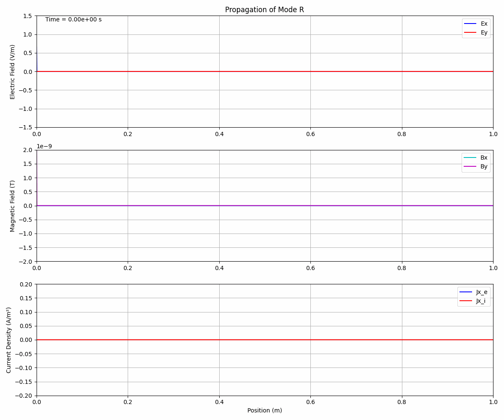

# 2D Plasma Fluid Simulator: Cold Plasma Wave Propagation  

  
  
  

---

## Description  

This project implements a **1D and 2D two-fluid plasma simulator** to model **electromagnetic wave propagation in magnetized cold plasmas**.  

The code solves the **coupled Maxwell-fluid equations** for both electrons and ions, including **collisions** and **realistic boundary conditions**.  

Main features:  

- Two-fluid model with separate electron and ion dynamics  
- Constant magnetic field in the z-direction (magnetized plasma)  
- Collisional effects for both electron-neutral and ion-neutral collisions  
- Perfectly Matched Layer (PML) boundary conditions for wave absorption  
- 4th-order Runge-Kutta (RK4) time integration scheme  
- Support for **1D and 2D simulations** with the same codebase  
- Analysis of wave modes: **R, L, O, and X** in magnetized plasmas  
- Dispersion relation calculations and comparison with theory  
- Faraday rotation and other polarization effects  

---

## Physical Model  

The simulator solves the following coupled equations:  

**Maxwell's Equations:**  

$\nabla \times E = -\frac{\partial B}{\partial t}$, $\quad  
\nabla \times B = \mu_0(J_e + J_i) + \mu_0 \epsilon_0 \frac{\partial E}{\partial t}$

**Electron Fluid Equations:**  

$\frac{\partial J_e}{\partial t} = \epsilon_0 \omega_{pe}^2 E + \omega_e J_e \times \hat{z} - \nu_e J_e$

**Ion Fluid Equations:**

$\frac{\partial J_i}{\partial t} = \epsilon_0 \omega_{pi}^2 E - \omega_i J_i \times \hat{z} - \nu_i J_i$

Where:  

- $\omega_{pe}, \omega_{pi}$: electron and ion plasma frequencies  
- $\omega_e, \omega_i$: electron and ion cyclotron frequencies  
- $\nu_e, \nu_i$: collision frequencies  

---

## Project Structure  

```
2FluidPlasmaSim/
├── include/                 # Header files
│   ├── simulator_base.hh    # Base simulator class
│   ├── simulator_1d.hh      # 1D simulator implementation
│   ├── simulator_2d.hh      # 2D simulator implementation
│   ├── plasma_params.hh     # Plasma parameters structure
│   └── dispersion.hh        # Dispersion relation calculations
├── src/                    # Source files
│   ├── main.cpp            # Main program with 1D/2D selection
│   ├── simulator_base.cpp  # Base class implementation
│   ├── simulator_1d.cpp    # 1D simulator implementation
│   ├── simulator_2d.cpp    # 2D simulator implementation
│   └── dispersion.cpp      # Dispersion relation implementation
├── pyscripts/              # Python visualization scripts
│   ├── fields.py           # 1D field visualization
│   ├── fields2d.py         # 2D field visualization
│   ├── propagation.py      # 1D wave propagation animation
│   ├── propagation2d.py    # 2D wave propagation animation
│   ├── dispersion.py       # Dispersion relation plotting
│   ├── check_fields.py     # Field analysis utilities
│   └── energy_check.py     # Energy analysis utilities
├── CMakeLists.txt          # Build configuration
└── LICENSE                 # MIT License
```

---

## Features  

**Simulation Capabilities:**  
- 1D wave propagation along z-direction with transverse fields  
- 2D wave propagation in x-y plane with full field components  
- Multiple wave modes: **R, L, O, X**  
- Collisional damping with adjustable collision frequencies  
- PML boundary conditions to minimize reflections  
- Adaptive time stepping based on CFL condition  

**Analysis Tools:**  
- Field component visualization (\(E_x, E_y, E_z, B_x, B_y, B_z\))  
- Current density analysis (electron and ion currents)  
- Dispersion relation verification  
- Wave propagation animations  
- Phase space diagrams for circularly polarized modes  
- Energy and momentum conservation checks  

---

## Build Instructions  

### Prerequisites  
- C++17 compatible compiler (GCC 7+, Clang 5+, MSVC 2019+)  
- CMake 3.12+  
- Python 3.6+ with **NumPy, Matplotlib** (for visualization)  

### Building the Project  

```bash
# Create build directory
mkdir build
cd build

# Configure with CMake
cmake ..

# Build the project
cmake --build . --config Release
```

On Windows (Visual Studio):  
```bash
cmake --build . --config Release --target ALL_BUILD
```

The executable will be generated as `plasma_sim` (Linux/macOS) or `plasma_sim.exe` (Windows).  

---

## Usage  

### Basic 1D Simulation  
```bash
./plasma_sim 1
```

### 2D Simulation  
```bash
./plasma_sim 2
```

**Command Line Options:**  
- `1` or `2`: simulation dimensionality (default: 1)  

---

## Simulation Output  

- `data/field_data_[MODE].csv` → Final field distributions  
- `data/field_data_2d_[MODE].csv` → 2D field distributions  
- `data/dispersion_data.csv` → Theoretical dispersion relations  
- `data/energy_evolution.csv` → Energy evolution calculations  
- `data/snap/` → Time snapshots for animations  

---

## Visualization  

### 1D Field Analysis  
```bash
python pyscripts/fields.py
```

### 2D Field Visualization  
```bash
python pyscripts/fields2d.py
```

### Wave Propagation Animations  
```bash
python pyscripts/propagation.py
python pyscripts/propagation2d.py
```

### Dispersion Relation Analysis  
```bash
python pyscripts/dispersion.py
```

### Energy evolution Analysis  
```bash
python pyscripts/energy_check.py
```
---

## Customization  

Edit `Options.txt` or modify parameters in `main.cpp`:  

```cpp
PlasmaParams params;
params.electron_density = 1e18;      // m^-3
params.magnetic_field = 0.1;         // Tesla
params.collision_frequency = 1e7;    // Hz
params.ion_density = 1e18;           // m^-3
params.ion_mass = params.PROTON_MASS;
params.ion_collision_frequency = 1e6; // Hz
```

Grid and time step example:  
```cpp
params.nx = 1000;    // 1D grid points
params.ny = 200;     // 2D grid points
params.length_x = 1.0; // domain size in meters

double dt = 0.1 * dz / params.LIGHT_SPEED; // CFL-based time step
int num_steps = 10000;
```

---

## Example Results  

  

The simulations demonstrate:  

- Wave mode conversion at plasma resonances  
- Faraday rotation of polarized waves  
- Collisional damping effects  
- Cutoff and resonance frequencies  
- Dispersion effects on wave propagation  

---

## Physics Validation  

- Dispersion relation verification against cold plasma theory  
- Energy conservation checks  
- Wave polarization analysis  
- Comparison with analytical solutions  
- Boundary condition effectiveness testing  

---

## License  

MIT License © 2025 Juan Pablo Solís Ruiz  

---

## References  

- Stix, T. H. *Waves in Plasmas* (1992)  
- Chen, F. F. *Introduction to Plasma Physics and Controlled Fusion* (1984)  
- Swanson, D. G. *Plasma Waves* (2003)  

---

## Contact  

- Author: Juan Pablo Solís Ruiz  
- Email: jp.sruiz18.tec@gmail.com  
- GitHub: [h4xter1612](https://github.com/h4xter1612)  

---

## Future Work  

- GPU acceleration (CUDA/OpenCL)  
- MPI parallelization for larger 2D simulations  
- Warm plasma effects (finite temperature)  
- Relativistic corrections  
- Three-dimensional simulations  
- Additional collision models (Coulomb collisions)  
- Interactive parameter tuning interface  

---

